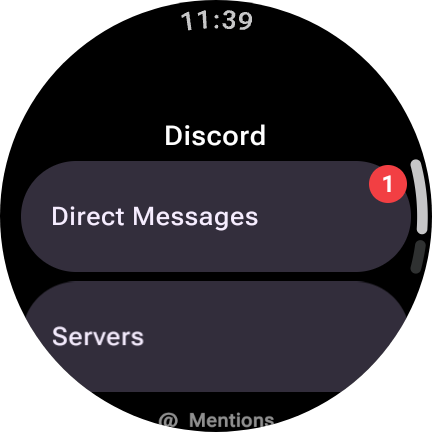
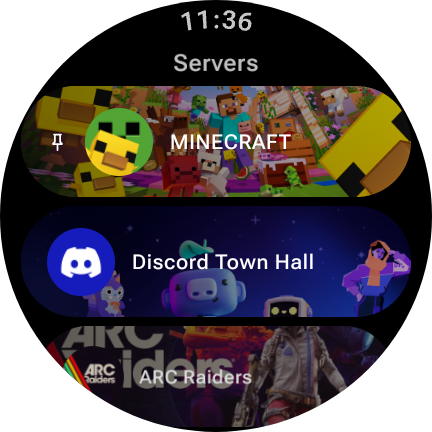
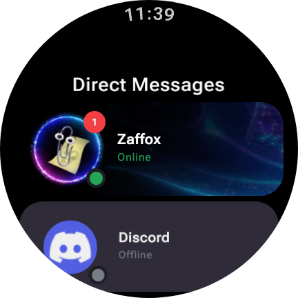
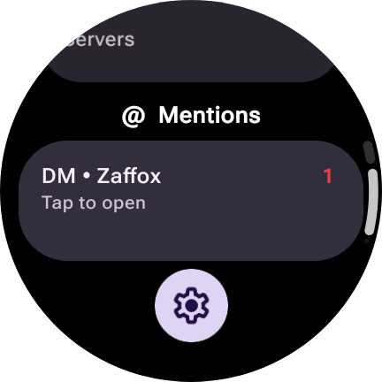
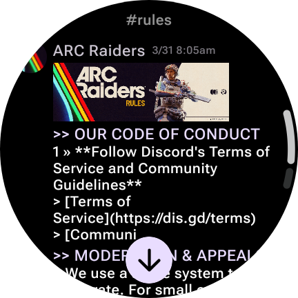
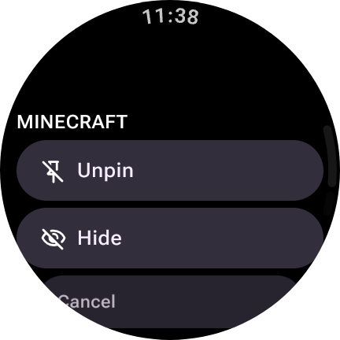

# Discord-wear
Discord For WearOS
### 3RD PARTY CLIENTS VIOLATE DISCORDS TERMS OF SERVICE
### I AM NOT RESPONSIBLE FOR ANY BANS

Note:there are very few reports of actual bans for 3rd party cilents alone.

  
Screenshots

  
 
 

 
 

Localhost website for token input on device on same LAN
192.168.1.123:1234 and it shows a basic webite so you dont have to type on a small screen :3

Known Bugs:
- Channels user does not access too stil appear

Currently working:
- Messages
- Embeds
- Server Stickers and Emoji
- Profile Images
- Replys
- Audio/Voice messages (can't send though)
- videos have partal supoort
- Nameplates

Not Working (mostly becsuse everything is for bot tokens and not user)
- Fowarded messages (API issue)
- bot commands
- hiding channels unavailable to user

what will Never work
- voice calls (E2E Requirement)
- Joining server (Captha)
_
